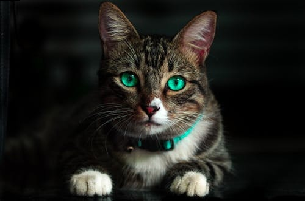

# steganography

Example code showing steganography in action

## Basic Premise

cleartext + raw image -> encoded image -> cleartext

## Encoding process

Text is encoded by setting each least significant bit (LSB) in the image with the bit value of each corresponding bit in the cleartext

## Results

The images below show that the original and encoded images appear to be exactly the same.

### Original Image

### Encoded Image

